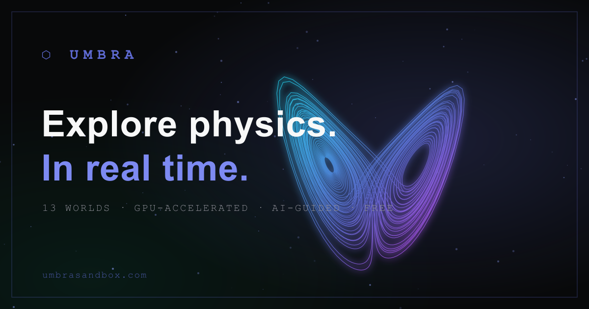

# ⬡ Umbra — Interactive 3D Physics, In Real Time

**[umbrasandbox.com](https://umbrasandbox.com)** · 13 GPU-accelerated physics worlds running live in your browser. No downloads, no account.



## What's inside

| Module | What you can do |
|---|---|
| General Relativity | Warp spacetime, watch matter spiral into a gravity well, trace geodesics |
| Quantum Mechanics | Tunneling, Bloch sphere, particle-in-a-box, double slit with measurement |
| Special Relativity | Light cones, time dilation, length contraction at up to 0.99c |
| Dynamical Systems | Lorenz, Rössler, Thomas, Aizawa attractors — 1,800 RK4-integrated particles |
| Electromagnetism | Real Biot-Savart field computation: dipoles, solenoids, Halbach arrays |
| Wave Mechanics | FDTD ripple tank, double slit, membrane normal modes |
| Thermodynamics | Gas simulation, entropy, Carnot cycles, Ising model |
| Fluid Dynamics | Kármán vortex street, SPH dam break, potential flow |
| Optics | Prism dispersion across 24 wavelengths, lens imaging, diffraction gratings |
| Frontier Physics | Galaxy rotation curves, Hubble expansion, black holes, N-body |
| Acoustic Physics | Chladni figures, harmonic series, Lissajous curves |
| Physics Sandbox | Drop attractors/repulsors/vortices onto a 900-tracer particle field |
| Wave Mechanics | Live 3D wave equation on a 128×128 mesh |

## Beyond the simulations

- **AI physics tutor** — asks about exactly what's on screen (Claude-powered)
- **Guided story journeys** — Galileo to Hawking, with XP and badges
- **Multiplayer rooms** — synced simulations for classrooms and study groups
- **Gesture control** — pinch and swipe the camera via webcam (MediaPipe)
- **Cinematic engine** — bloom, reflections, hyperspace transitions, synthesized sound
- **Embed anywhere** — every sim works as an iframe in Canvas, Moodle, Notion
- **Presentation mode** — press `P` for fullscreen classroom projection

## For educators

Every simulation embeds with one line:

```html
<iframe src="https://umbrasandbox.com/?embed=1#general-relativity"
        width="800" height="520" style="border:0" allowfullscreen></iframe>
```

School and district licensing: [hamzahatef09@gmail.com](mailto:hamzahatef09@gmail.com?subject=Umbra%20school%20license)

## Stack

React 19 · Three.js / React Three Fiber · Zustand · Tailwind · Vite · Anthropic SDK · MediaPipe · KaTeX — deployed on Vercel.

## Develop

```bash
npm install
npm run dev      # local dev server
npm run build    # production build
node scripts/make-og.mjs  # regenerate the social card
```

## Payments (Stripe)

Umbra Pro checkout runs through Stripe Checkout via two Vercel serverless
functions in `/api`:

- `POST /api/checkout` — creates a subscription Checkout Session (Stripe Tax on)
- `POST /api/stripe-webhook` — verifies signature, handles subscription lifecycle

Set these environment variables in Vercel (Project → Settings → Environment Variables):

| Variable | Value |
|---|---|
| `STRIPE_SECRET_KEY` | `sk_test_…` then `sk_live_…` (secret — never client-side) |
| `STRIPE_PRICE_PRO` | `price_…` for the $6/mo recurring Pro price |
| `STRIPE_WEBHOOK_SECRET` | `whsec_…` from the webhook endpoint |

The Pro button falls back to the contact/email flow until these are set, so the
site never breaks mid-setup. School/Classroom licensing stays a contact flow
(invoiced manually in the Stripe dashboard).

## Accounts (Supabase)

Auth + profiles run on Supabase. Sign-in (magic link / Google / password) is in
`AuthPanel`; `AuthContext` exposes `{ user, isPro, ... }`. The Stripe webhook
flips `is_pro` on the user's profile via the service-role key, so Pro unlocks
automatically after checkout.

1. Create a Supabase project, then run `supabase-schema.sql` in the SQL Editor.
2. Set env vars in Vercel:

| Variable | Scope | Value |
|---|---|---|
| `VITE_SUPABASE_URL` | all | Project URL (public) |
| `VITE_SUPABASE_ANON_KEY` | all | anon/public key |
| `SUPABASE_SERVICE_ROLE_KEY` | Production | service-role key (SECRET — webhook only) |

3. In Supabase → Authentication → URL Configuration, set Site URL to
   `https://umbrasandbox.com` and add it to Redirect URLs.
4. (Optional) enable the Google provider under Authentication → Providers.

Until these are set, auth UI shows "accounts aren't enabled yet" and the rest of
the app runs normally.
